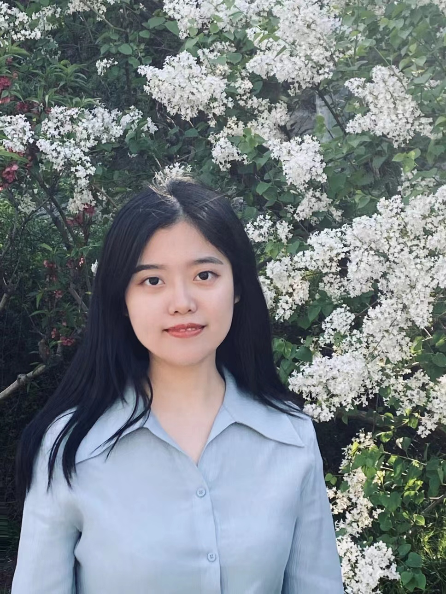

## About Me

Master Student at Tsinghua University

Hi! I am a third year master student in Computer Science at Tsinghua University, where I obtained a bachelor's degree in Software Engineering at Tianjin University in 2019. I conduct research under the supervison of Prof. [Wenwu Zhu](https://scholar.google.com/citations?user=7t2jzpgAAAAJ&hl=en) and Prof. [Xin Wang](http://mn.cs.tsinghua.edu.cn/xinwang/).

My research interests include video understanding and multi-modal learning.

Email: pinci_yang@outlook.com

## Publications
### Conference Paper
1. Pinci Yang, Xin Wang, Xuguang Duan, Hong Chen, Runze Hou, Cong Jin, Wenwu Zhu: AVQA: A Dataset for Audio-Visual Question Answering on Videos. MM 2022. In Proceedings of the 30th ACM Multimedia Conference on Multimedia.

### Patent
1. 朱文武, 王鑫, 杨品慈. 用于音视频问答的层次化声音-视觉特征融合方法及产品：中国, CN202210936845.6\[P\].
